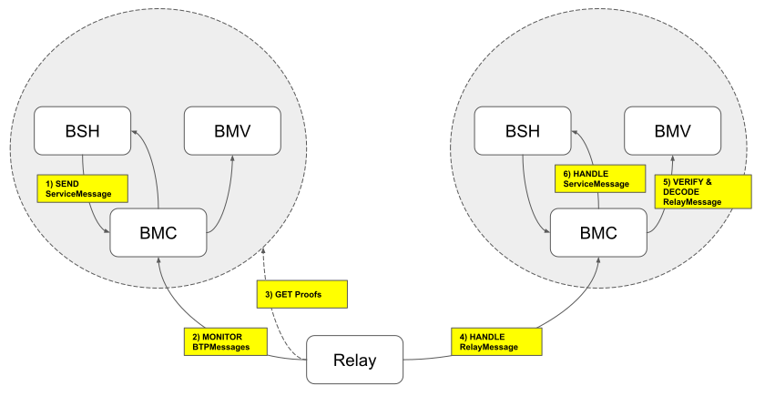

## Simple Summary

Standard interfaces for contracts used in Blockchain Transmission Protocol (BTP)

## Abstract
<!--
Blockchain Transmission Protocol is used to deliver messages between blockchains. There're two kinds of applications are used in the protocol. The relay is used to deliver messages between blockchains. The relay delivers the messages and the smart contracts handle the delivered messages. Those smart contracts verify and decode the delivered messages, then it processes the decoded messages according to the services. Complex and heavy functions of smart contracts can be shared if they are implemented in standardized interfaces. And also they can be extended more easily.
-->
Blockchain Transmission Protocol is used to deliver messages between blockchains.
A Relay delivers BTP messages between blockchains and smart contracts will verify and decode the delivered messages according to the services.
Complex and heavy functions of smart contracts can be shared if they are implemented according to standardized interfaces. Smart contracts are also more extensible staying compliant to the standards.


## Motivation

BTP Messages from multiple services are delivered to multiple blockchains.
BTP smart contracts to support multiple services and blockchains.
BTP Message Center (BMC) is the center of smart contracts.

For each blockchain, BTP Message Verifier (BMV) verifies the relay message and decodes it into standardized messages (BTP Messages).

For each service, BTP Message Handler (BSH) handles received messages of the service and sends messages through the BTP Message Center (BMC).


## Specification

### Terminology

* [Network Address](#network-address)

  A string to identify blockchain network

* [BTP Address](#btp-address)

  A string of URL for locating an account of the blockchain network

* [Relay Message](#relay-message)

  A message that a relay sends to the blockchain.

* [BTP Message](#btp-message)

  Standardized messages delivered between different blockchains

* [BTP Message Center (BMC)](#btp-message-center)

  BMC accepts messages from a relay (Relay Messages).
  A Relay Message contains standardized messages (BTP Messages) and proof of existence for these messages.
  Corresponding BMV will verify and decode the Relay Message, then the BMC will process the BTP Messages.

  If the destination of the message isn't current BMC, then it's sent to the next BMC to reach its destination.
  If current BMC is the destination, then it's dispatched to the corresponding BSH.
  If the message cannot be processed, then it sends an error back to the source.


* [BTP Message Verifier (BMV)](#btp-message-verifier)

  BMV verifies a Relay Message and decodes it into BTP Messages.


* [BTP Service Handler (BSH)](#btp-service-handler)

  BSH handles BTP Messages of the service. It also sends messages according to different service scenarios.

### Network Address

A string to identify blockchain network

```
<NID>.<Network System>
```

**Network System**:
Short name of the blockchain network system.

| Name     | Description           |
|:---------|:----------------------|
| icon     | ICON MainNet (goloop) | 
| moonbeam | Moonbeam              |

**NID**:
ID of the network in the blockchain network system.

> Example

| Network Address | Description                                               |
|:----------------|:----------------------------------------------------------|
| `0x1.icon`      | ICON network with nid="0x1" (main net)                    |
| `0x2.icon`      | ICON sub network with nid="0x2" (sub network on main net) |
| `0x5.moonbeam`  | Moonbeam network with nid="0x5"                           |

### BTP Address

A string of URL for locating an account of the blockchain network

> Example
```
btp://<Network Address>/<Account Identifier>
```
**Account Identifier**:
Identifier of the account including smart contract.
It should be composed of URL safe characters except "."(dot).

> Example
```
btp://0x1.icon/hxc0007b426f8880f9afbab72fd8c7817f0d3fd5c0
btp://0x2.icon/hx7ab72fd8c7812680f9afbab72fd8c7817f0d3fd5
btp://0x5.moonbeam/0x5425F5d4ba2B7dcb277C369cCbCb5f0E7185FB41
```

It could be expanded to other resources.

### BTP Message

A message delivered across blockchains.

| Name | Type    | Description                                          |
|:-----|:--------|:-----------------------------------------------------|
| src  | String  | BTP Address of source BMC                            |
| dst  | String  | BTP Address of destination BMC                       |
| svc  | String  | name of the service                                  |
| sn   | Integer | serial number of the message                         |
| msg  | Bytes   | serialized bytes of Service Message or Error Message |

if **sn** is negative, **msg** should be Error Message.
It would be serialized in [RLP serialization](#rlp-serialization).


### Error Message

A message for delivering error information.

| Name | Type    | Description   |
|:-----|:--------|:--------------|
| code | Integer | error code    |
| msg  | String  | error message |

It would be serialized in [RLP serialization](#rlp-serialization).


### RLP serialization

For encoding [BTP Message](#btp-message) and [Error Message](#error-message), it uses Recursive Length Prefix (RLP).
RLP supports bytes and list naturally.
Here are some descriptions about other types.

#### String

It uses UTF-8 encoded bytes of the string.
There is no termination bytes.

#### Integer

It uses the shortest form of two's complemented bytes representations.
If it's negative, the highest bit of the first byte should be 1.

> Example

| Value | Encoded bytes |
|:------|:--------------|
| 0     | 0x00          |
| -1    | 0xff          |
| -128  | 0x80          |

### Relay Message

It's used to deliver BTP Messages along with other required contents. Normally, it contains the following.

* BTP Messages along with their proof of existence
* Trust information updates along with their proof of consensus

The relay gathers the information through APIs of a source blockchain system and its internal database. The actual content of the message is decided according to the blockchain system and BMV implementation.


### BTP Message Center

#### Introduction

BTP Message Center is a smart contract that builds BTP Message and sends it to a relay and handles Relay Message from the other relay. It stores the following information.

* Routing information
  * Reachable networks and corresponding BMCs
  * Next BMCs for reachable networks
  * Directly connected networks
  * Current network address
* Smart contracts
  * BMV address for the directly connected network
  * BSH address for the service

#### Setup

1. Registers [BSH](#btp-service-handler)s for the services.
   (BSH should be deployed before the registration)
2. Registers [BMV](#btp-message-verifier)s for the directly connected blockchains.
   (BMV should be deployed before the registration)
3. Adds links, BMCs of directly connected blockchains
4. Adds routes to other BMCs of in-directly connected blockchains

#### Send a message

BSH sends a message through [BMC.sendMessage](#sendmessage). It accepts only requests from the registered BTP Service Handler (BSH). If the service name of those requests is not in the service names of the BSH, then it will be rejected.

Then it builds a BTP Message from the request.
1. Decides destination BMC from the given Network Address
2. Fills in other information from given parameters.
3. Serializes them for sending.

Then it tries to send the BTP Message.
1. Decide next BMC from the destination referring routing information.
2. Get sequence number corresponding to the next.
3. Emit the event, [Message](#message) including the information.

The event will be monitored by the Relay, it will build Relay Message
for next BMC.

#### Receive a message

It receives the Relay Message, then it tries to decode it with registered
BMV. It may contain multiple BTP Messages.
It dispatches received BTP Messages one-by-one in sequence.

If it is the destination, then it tries to find the BSH for the
service, and then calls [BSH.handleBTPMessage](#handlebtpmessage).
It calls [BSH.handleBTPError](#handlebtperror) if it's an error.

If it's not the destination, then it sends the message to
the next BMC reaching the destination.

If it fails, then it replies an error.
BTP Message with error reply is composed of the following,
* sn : negated serial number of the message.
* dst : BTP Address of the source.
* src : BTP Address of the BMC.
* msg : Error Message including error code and message.

#### BMC service message

BMC service message is a BTP message dispatched by BMC.

###### Format

```
svc: "bmc"
```

##### BMC Service Message

| Name    | Type   | Description                                            |
| :------ | :----- | :----------------------------------------------------- |
| type    | String | type of BMC Service Message (Init, Link, Unlink, Sack) |
| payload | Bytes  | serialized bytes of Message                            |

##### Init Message

send to given _link on [BMC.addLink](#addlink)

| Name  | Type           | Description                          |
| :---- | :------------- | :----------------------------------- |
| links | List of String | list of BTP Address of connected BMC |

BMC could update status of connected BMC to use to resolve route.

##### Link Message

send to all of connected BMC except given _link on [BMC.addLink](#addlink)

| Name | Type   | Description                  |
| :--- | :----- | :--------------------------- |
| link | String | BTP Address of connected BMC |

BMC could update status of connected BMC to use to resolve route.

##### Unlink Message

send to all of connected BMC except given _link on [BMC.removeLink](#removelink)

| Name | Type   | Description                  |
| :--- | :----- | :--------------------------- |
| link | String | BTP Address of connected BMC |

BMC could update status of connected BMC to use to resolve route.

##### Sack Message

BMC could send to previous BMC on [BMC.handleRelayMessage](#handlerelaymessage) periodically

| Name   | Type    | Description                           |
| :----- | :------ | :------------------------------------ |
| height | Integer | Height of BMV                         |
| seq    | Integer | Sequence of last received BTP Message |

BMC could reject on [BMC.sendMessage](#sendmessage) using above information if necessary.

#### Interface

##### Writable methods

###### handleRelayMessage
```python
@external
def handleRelayMessage(self, _prev: str, _msg: str):
```
* Params
  - _prev: String ( BTP Address of the previous BMC )
  - _msg: String ( base64 encoded string of serialized bytes of Relay Message )
* Description:
  - It verifies and decodes the Relay Message with BMV and dispatches BTP
    Messages to registered BSHs.
  - It's allowed to be called by the BMC.

###### sendMessage
```python
@external
def sendMessage(self, _to: str, _svc: str, _sn: int, _msg: bytes):
```
* Params
  - _to: String ( Network Address of destination network )
  - _svc: String ( name of the service )
  - _sn: Integer ( serial number of the message, must be positive )
  - _msg: Bytes ( serialized bytes of Service Message )
* Description:
  - Sends the message to a specific network.
  - Only allowed to be called by registered BSHs.

###### addService
```python
@external
def addService(self, _svc: str, _addr: Address):
```
* Params
  - _svc: String (the name of the service)
  - _addr: Address (the address of the smart contract handling the service)
* Description:
  - Registers the smart contract for the service.
  - Called by the operator to manage the BTP network.

###### removeService
```python
@external
def removeService(self, _svc: str):
```
* Params
  - _svc: String (the name of the service)
* Description:
  - De-registers the smart contract for the service.
  - Called by the operator to manage the BTP network.

###### addVerifier
```python
@external
def addVerifier(self, _net: str, _addr: Address):
```
* Params
  - _net: String (Network Address of the blockchain )
  - _addr: Address (the address of BMV)
* Description
  - Registers BMV for the network.
  - Called by the operator to manage the BTP network.

###### removeVerifier
```python
@external
def removeVerifier(self, _net: str):
```
* Params
  - _net: String (Network Address of the blockchain )
* Description
  - De-registers BMV for the network.
  - May fail if it's referred by the link.
  - Called by the operator to manage the BTP network.

###### addLink
```python
@external
def addLink(self, _link: str):
```
* Params
  - _link: String (BTP Address of connected BMC)
* Description
  - If it generates the event related to the link, the relay shall
    handle the event to deliver BTP Message to the BMC.
  - If the link is already registered, or its network is already
    registered then it fails.
  - If there is no verifier related with the network of the link,
    then it fails.
  - Initializes status information for the link.
  - Called by the operator to manage the BTP network.

###### removeLink
```python
@external
def removeLink(self, _link: str):
```
* Params
  - link: String (BTP Address of connected BMC)
* Description
  - Removes the link and status information.
  - Called by the operator to manage the BTP network.

###### addRoute
```python
@external
def addRoute(self, _dst: str, _link: str):
```
* Params
  - _dst: String ( BTP Address of the destination BMC )
  - _link: String ( BTP Address of the next BMC for the destination )
* Description:
  - Add route to the BMC.
  - May fail if there more than one BMC for the network.
  - Called by the operator to manage the BTP network.

###### removeRoute
```python
@external
def removeRoute(self, _dst: str):
```
* Params
  - dst: String ( BTP Address of the destination BMC )
* Description:
  - Remove route to the BMC.
  - Called by the operator to manage the BTP network.

##### Read-only methods

###### getServices
```python
@external(readonly=True)
def getServices(self) -> dict:
```
* Description
  - Get registered services.
* Returns
  - A dictionary with the name of the service as key and address of the BSH
    related to the service as value.
    ```json
    {
      "token": "cx72eaed466599ca5ea377637c6fa2c5c0978537da"
    }
    ```

###### getVerifiers
```python
@external(readonly=True)
def getVerifiers(self) -> dict:
```
* Description
  - Get registered verifiers.
* Returns
  - A dictionary with the Network Address as a key and smart contract
    address of the BMV as a value.
    ```json
    {
        "0x1.icon": "cx72eaed466599ca5ea377637c6fa2c5c0978537da"
    }
    ```

###### getLinks
```python
@external(readonly=True)
def getLinks(self) -> list:
```
* Description
  - Get registered links.
* Returns
  -  A list of links ( BTP Addresses of the BMCs )
  ```json
  [ "btp://0x1.icon/cx9f8a75111fd611710702e76440ba9adaffef8656" ]
  ```

###### getRoutes
```python
@external(readonly=True)
def getRoutes(self) -> dict:
```
* Description:
  - Get routing information.
* Return
  - A dictionary with the BTP Address of the destination BMC as key and
    the BTP Address of the next as value.
    ```json
    {
      "btp://0x2.icon/cx1d6e4decae8160386f4ecbfc7e97a1bc5f74d35b": "btp://0x1.icon/cx9f8a75111fd611710702e76440ba9adaffef8656"
    }
    ```

###### getStatus
```python
@external(readonly=True)
def getStatus(self, _link: str) -> dict:
```
* Params
  - _link: String ( BTP Address of the connected BMC )
* Description:
  - Get status of BMC.
  - Used by the relay to resolve next BTP Message to send.
  - If target is not registered, it will fail.
* Return
  - The object contains followings fields.

    | Field    | Type    | Description                                      |
    |:---------|:--------|:-------------------------------------------------|
    | tx_seq   | Integer | next sequence number of the next sending message |
    | rx_seq   | Integer | next sequence number of the message to receive   |
    | verifier | Object  | status information of the BMV                    |


##### Events

###### Message
```python
@eventlog(indexed=1)
def Message(self, _next: str, _seq: int, _msg: bytes):
```
* Indexed: 1
* Params
  - _next: String ( BTP Address of the BMC to handle the message )
  - _seq: Integer ( sequence number of the message from current BMC to the next )
  - _msg: Bytes ( serialized bytes of BTP Message )
* Description
  - Sends the message to the next BMC.
  - The relay monitors this event.

### BTP Message Verifier

#### Introduction

BTP Message Verifier verifies and decodes Relay Messages to
[BTP Message](#btp-message)s.
A Relay Message is composed of both BTP Messages and with proof of
existence for these BTP Messages.

For easy verification, it may update trust information for the
followed events. Most of the implementations may track the hashes of block
headers.

If the blockchain system provides proof of absence of the
BTP Messages, then it's enough for the verifier to sustain the last state only.
It updates the hash only if it sees proof of absence of further
BTP Messages in the block.

Most blockchain systems don't provide proof of absence for their data, therefore, it is mandatory to
provide methods to verify historical hashes.

Merkle Accumulator can be used for verifying old hashes.
BMV sustains roots of Merkle Tree Accumulator, and relay
will sustain all elements of Merkle Tree Accumulator. The relay
may make the proof of any one of old hashes.
So, even if byzantine relay updated the trust information with the
proof of new block, normal relay can send BTP Messages in
the past block with the proof.

#### Interface

##### Writable methods

###### BMV.handleRelayMessage
```python
@external
def handleRelayMessage(self, _bmc: str, _prev: str, _seq: int, _msg: bytes) -> list:
```
* Description
  - Decodes Relay Messages and process BTP Messages
  - If there is an error, then it sends a BTP Message containing the
    Error Message
  - BTP Messages with old sequence numbers are ignored. A BTP Message contains future sequence number will fail.
* Params
  - _bmc: String ( BTP Address of the BMC handling the message )
  - _prev: String ( BTP Address of the previous BMC )
  - _seq: Integer ( next sequence number to get a message )
  - _msg: Bytes ( serialized bytes of Relay Message )
* Returns
  - List of serialized bytes of a [BTP Message](#btp-message)

### BTP Service Handler

#### Introduction

BSH can send messages through BTP Message Center(BMC) from any user
request, the request can also come from other smart contracts.
BSHs are also responsible for handling message from other BSHs.

BSH can communicate with other BSHs with the same service name.
If there is already a service using the same name, then it should choose
a different name for the service when registering a new service.
If the intention is to become a part of the service, then it should
use same name. BSH follows the protocol of the service.

Before a BSH is registered to the BMC, it's unable to send messages, and unable to handle messages from others.
To become a BSH, following criteria must be met,

1. Implements the interface
2. Registered to the BMC through [BMC.addService](#addservice)

After registration, it can send messages through
[BMC.sendMessage](#sendmessage).
If there is an error while delivering message, BSH will
return error information though [handleBTPError](#handlebtperror).
If messages are successfully delivered, BMC will call
[handleBTPMessage](#handlebtpmessage) of the target BSH.
While processing the message, it can reply though
[BMC.sendMessage](#sendmessage).

#### Security

BSH should not handle messages or errors from other contract
except BMC.
BMC also accepts only the service messages from registered BSH.
BSH can have other APIs, but APIs related with BMC are
only called by BMC.

#### Interface

##### Writable methods

###### handleBTPMessage
```python
@external
def handleBTPMessage(self, _from: str, _svc: str, _sn: int, _msg: bytes):
```
* Description
  - Handles BTP Messages from other blockchains.
  - Accepts messages only from BMC.
  - If it fails, then BMC will generate a BTP Message that includes
    error information, then delivered to the source.
* Params
  - _from: String ( Network Address of source network )
  - _svc: String ( name of the service )
  - _sn: Integer ( serial number of the message )
  - _msg: Bytes ( serialized bytes of ServiceMessage )

###### handleBTPError
```python
@external
def handleBTPError(self, _src: str, _svc: str, _sn: int, _code: int, _msg: str):
```
* Description
  - Handle the error on delivering the message.
  - Accept the error only from the BMC.
* Params
  - _src: String ( BTP Address of BMC that generated the error )
  - _svc: String ( name of the service )
  - _sn: Integer ( serial number of the original message )
  - _code: Integer ( code of the error )
  - _msg: String ( message of the error )


### Message delivery flow



1. BSH sends a Service Message through BMC.

   * BSH calls [BMC.sendMessage](#sendmessage) with followings.

     | Name    | Type    | Description                                   |
     |:--------|:--------|:----------------------------------------------|
     | _to     | String  | Network Address of the destination blockchain |
     | _svc    | String  | Name of the service.                          |
     | _sn     | Integer | Serial number of the message.                 |
     | _msg    | Bytes   | Service message to be delivered.              |

   * BMC lookup the destination BMC belonging to *_to*.
     If there is no known BMC to the network, then it will fail.

   * BMC builds a BTP Message.

     | Name | Type    | Description                                   |
     |:-----|:--------|:----------------------------------------------|
     | src  | String  | BTP Address of current BMC                    |
     | dst  | String  | BTP Address of destination BMC in the network |
     | svc  | String  | Given service name                            |
     | sn   | Integer | Given serial number                           |
     | msg  | Bytes   | Given service message                         |

   * BMC decide the next BMC according to the destination.
     If there is no route to the destination BMC.

   * BMC generates an event with BTP Message.

     | Name  | Type    | Description                                |
     |:------|:--------|:-------------------------------------------|
     | _next | String  | BTP Address of the next BMC                |
     | _seq  | Integer | Sequence number of the msg to the next BMC |
     | _msg  | Bytes   | Serialized BTP Message                     |

2. The BTP Message Relay(BMR) detects events.
   * Relay detects [BMC.Message](#message) through various ways.
   * Relay can confirm that it occurs and it's finalized.

3. BMR gathers proofs
   * Relay gathers proofs of the event(POE)s
     - Proof for the new block
     - Proof for the event in the block
   * Relay builds Relay Message including the following,
     - Proof of new events
     - New events including the BTP Message.
   * Relay calls [BMC.handleRelayMessage](#handlerelaymessage)
     with built Relay Message.

   | Name  | Type   | Description                                     |
   |:------|:-------|:------------------------------------------------|
   | _prev | String | BTP Address of the previous BMC                 |
   | _msg  | Bytes  | serialized Relay Message including BTP Messages |

4. BMC handles Relay Message

   * It finds BMV for the network address of the previous BMC.
   * It gets the sequence number of the next message from the source network.
   * BMC calls [BMV.handleRelayMessage](#bmvhandlerelaymessage)
     to decode Relay Message and gets a list of BTP Messages.

     | Name  | Type    | Description                                               |
     |:------|:--------|:----------------------------------------------------------|
     | _bmc  | String  | BTP Address of the current BMC                            |
     | _prev | String  | BTP Address of given previous BMC                         |
     | _seq  | Integer | Next sequence number of the BTP Message from previous BMC |
     | _msg  | Bytes   | The Relay Message                                         |

5. BMV decodes Relay Message

   * Verifies and decodes Relay Messages, then returns a list of
     BTP Messages.
   * If verification of the message is unsuccessful, it fails.
   * The events from the previous BMC to the current BMC will be processed.
   * The events should have proper sequence number, otherwise it fails.

6. BSH handles Service Messages

   * BMC dispatches BTP Messages.
   * If the destination BMC isn't current one, then it locates
     the next BMC and generates the event.
   * If the destination BMC is the current one, then it locates BSH
     for the service of the BTP Message.
   * Calls [BSH.handleBTPMessage](#handlebtpmessage) if
     the message has a positive value as *_sn*.

     | Name  | Type    | Description                           |
     |:------|:--------|:--------------------------------------|
     | _from | String  | Network Address of the source network |
     | _svc  | String  | Given service name                    |
     | _sn   | Integer | Given serial number                   |
     | _msg  | Bytes   | Given service message                 |

   * Otherwise, it calls [BSH.handleBTPError](#handlebtperror).

     | Name  | Type    | Description                                    |
     |:------|:--------|:-----------------------------------------------|
     | _src  | String  | BTP Address of the BMC that generated the error|
     | _svc  | String  | Given service name                             |
     | _sn   | Integer | Given serial number                            |
     | _code | Integer | Given error code                               |
     | _msg  | String  | Given error message                            |


## Rationale
<!--The rationale fleshes out the specification by describing what motivated the design and why particular design decisions were made. It should describe alternate designs that were considered and related work, e.g. how the feature is supported in other languages. The rationale may also provide evidence of consensus within the community, and should discuss important objections or concerns raised during discussion.-->


## Implementation
<!--The implementations must be completed before any IIP is given status "Final", but it need not be completed before the IIP is accepted. While there is merit to the approach of reaching consensus on the specification and rationale before writing code, the principle of "rough consensus and running code" is still useful when it comes to resolving many discussions of API details.-->

## Copyright
Copyright and related rights waived via [CC0](https://creativecommons.org/publicdomain/zero/1.0/).
